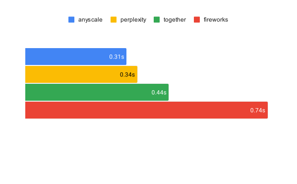
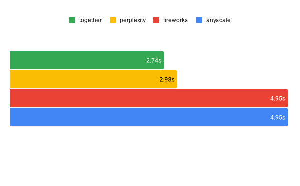
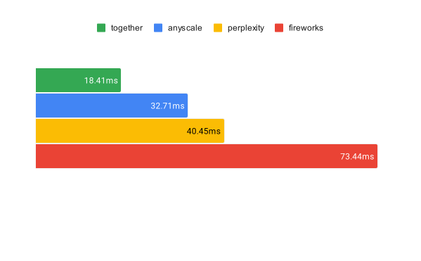

# llmperf

LLMPerf is a tool for benchmarking and validating the performance of LLMs. 

Benchmarking: LLMPerf measures time to first token (TTFT), 
inter-token latency (ITL) and requests that take longer than 3 seconds 
to start returning data. 

Validation: we send a simple query to the LLM and ensure the returned data 
is valid. In particular it checks for inter-request cross-over 
(request A gets the responses for request B). 

Variation in input and output token lengths is a design parameter
since this is intended to be representative. This is because
there are some optimizations (e.g. continuous batching) that 
we know work better with varying input and output length. 

## LLMPerf Leaderboard :trophy:

We have utilized the LLMPerf library to conduct benchmarking analysis of several selective endpoint providers,
including Fireworks, TogetherAI, Anyscale, Perplexity, and others. 
This benchmarking was aimed at evaluating the performance, reliability, and efficiency of these providers under various conditions. 
We hope the results obtained from this exercise help people understand the capabilities and limitations of each provider, thereby aiding in making informed decisions for future integrations and deployments. Here is a detailed report of our findings.

(Results as of November 21, 2023)

### Time to first token (seconds)

In streaming applications, the TTFT is how long before the LLM returns the first token.



| Framework  | Model                                   | Mean  | Percentiles (P25 \| P50 \| P75 \| P90 \| P95)      |
|------------|-----------------------------------------|-------|----------------------------------------------------|
| anyscale   | meta-llama/Llama-2-70b-chat-hf          | 0.31  | 0.28 \| 0.29 \| 0.33 \| 0.39 \| 0.46              |
| perplexity | llama-2-70b-chat                        | 0.34  | 0.28 \| 0.29 \| 0.35 \| 0.48 \| 0.56              |
| together   | togethercomputer/llama-2-70b-chat       | 0.44  | 0.36 \| 0.38 \| 0.49 \| 0.55 \| 0.64              |
| fireworks  | fireworks/models/llama-v2-70b-chat      | 0.74  | 0.64 \| 0.72 \| 0.80 \| 0.96 \| 1.11              |


### E2E Time (seconds) 

The end to end time from when the request is made to the last token is received in the response.



| Framework  | Model                                   | Mean  | Percentiles (P25 \| P50 \| P75 \| P90 \| P95)      |
|------------|-----------------------------------------|-------|----------------------------------------------------|
| together   | togethercomputer/llama-2-70b-chat       | 2.74  | 2.47 \| 2.73 \| 3.00 \| 3.22 \| 3.33              |
| perplexity | llama-2-70b-chat                        | 2.98  | 2.90 \| 3.04 \| 3.15 \| 3.26 \| 3.34              |
| anyscale   | meta-llama/Llama-2-70b-chat-hf          | 4.95  | 4.80 \| 4.96 \| 5.13 \| 5.27 \| 5.36              |
| fireworks  | fireworks/models/llama-v2-70b-chat      | 4.95  | 4.34 \| 5.19 \| 5.51 \| 5.98 \| 6.29              |


### Inter Token Latency (ms)

Inter-token latency is the average time between consecutive tokens, this is to avoid bias in systems that start streaming very late in end-to-end measurement. (Since not all systems support streaming, we have also omitted the percentiles since it's not meaningful).



| Framework  | Model                                   | Mean  |
|------------|-----------------------------------------|-------|
| together   | togethercomputer/llama-2-70b-chat       | 18.41 |
| anyscale   | meta-llama/Llama-2-70b-chat-hf          | 32.71 |
| perplexity | llama-2-70b-chat                        | 40.45 |
| fireworks  | fireworks/models/llama-v2-70b-chat      | 73.44 |


### Run Configurations

For each of the benchmark run, it is performed with the below command template:

```
   python token_benchmark_ray.py \
    --model <MODEL_NAME> \
    --mean-input-tokens 550 \
    --stddev-input-tokens 0 \
    --mean-output-tokens 150 \
    --stddev-output-tokens 0 \
    --max-num-completed-requests 150 \
    --num-concurrent-requests 5 \
    --llm-api <litellm/openai> 
```


## Supported endpoints 

Currently supported endpoints include: 

- Any OpenAI compatible endpoints, including Anyscale Endpoints, 
Anyscale Private Endpoints, OpenAI, Fireworks, Perplexity etc
- Any [Huggingface Text Generation Inference](https://github.com/huggingface/text-generation-inference) endpoints
- Together 
- Vertex AI
- SageMaker

Please see `requirements.txt` for more details on dependency requirements.

## Upcoming refactor

This is prototype code. We are currently refactoring the code to be more
extensible (including a pluggable endpoints, varying traffic load etc). 

In addition we plan to:

- Make running the benchmark not only possible from 
command line, but also possible to integrate easily into CI/CD or job scheduling 
systems. 
- Control where the generated files and information go. 
- Automate report generation. 

We expect this refactor to be complete some time in November 2023. 

## A note on rate limits

Many LLM providers have extremely low rate limits by default (e.g. Perplexity 3 requests per 90 seconds). 

You can use the sleep parameter to overcome these difficulties, but it does affect the representativeness of the results. 

Other systems do not have rate limits, but we consider that if the TTFT exceeds 3 second for more than 
5% of queries that the system is overloaded. 


## Default values

Default values are the ones that we use for testing Anyscale Endpoints. 
The distribution of inputs and outputs roughly mirrors the input and output 
patterns we see there. 

We recommend setting the seed (or using the provided seed) to reduce variance but 
still have randomization.

Do a python llmperf.py --help to see all options. 

## Usage
1. Provide API base and key in .env file. Check out env_sample.txt
2. Test out Anyscale Endpoint with following command by sending 20 requests   
`python llmperf.py -r 20 -m "meta-llama/Llama-2-70b-chat-hf"`
3. Control input token numbers by setting min/max lines, and control output token number by setting req-lines and max_tokens  
`python llmperf.py -r 20 -f openai -m "gpt-3.5-turbo" --min-lines 8 --max-lines 10`  
`python llmperf.py -r 20 -f openai -m "gpt-3.5-turbo" --req-lines 3 --max-tokens 128`
4. Control sleep between rounds to avoid hitting rate limit  
`python llmperf.py -r 20 -f fireworks -m "accounts/fireworks/models/llama-v2-70b-chat" --sleep 10`
5. Output will be saved at **framework-timestamp.json** and **framework-timestamp_raw.json**  
6. Use Jupyter with analyze-raw.ipynb to visualize and/or interact with the raw data. 

